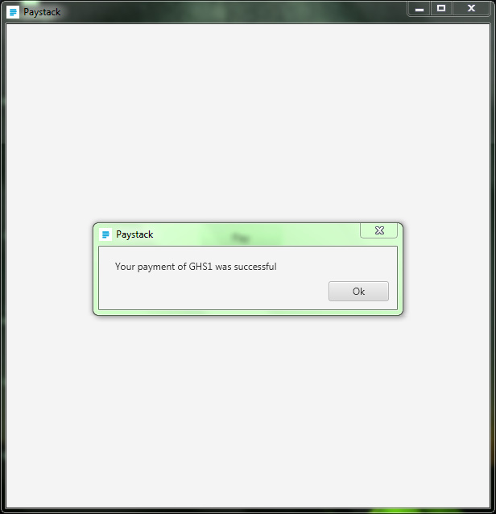

## Paystack B4J Library

This is a library for easy integration of [Paystack](https://paystack.com) with your Android application with [B4J](https://www.b4x.com/b4j.html).
Use this library in your B4J project.

## Summarized flow

1. Collect user's details such as email & name

2. Initialize the transaction
	- Call the [Initialize Transaction](https://paystack.com/docs/api/#transaction-initialize) endpoint
    - App will loads [WebView](https://b4x.com/android/help/views.html#webview) to initialize a transaction
    - User enter details for transaction

4. Once successful, a prompt will be displayed.

## Requirements
- None

## Installation & Usage

### B4J
#### Download Paystack.jar & Paystack.xml and place in your additional libraries folder
#### Enable the Paystack Library in your Libraries Tab
#### Assign Paystack Library to a Variable

```
Sub Globals
	Private fx As JFX
	Private MainForm As Form
	Private xui As XUI 'ignore
	Private Button1 As Button
	Dim Pay As Paystack
End Sub
```
#### Initialize Paystack Library
```
Sub AppStart (Form1 As Form, Args() As String)
	MainForm = Form1
	MainForm.RootPane.LoadLayout("Main")
	MainForm.Show
End Sub
```

#### Perform a transaction
```
Private Sub Button1_Click
	Pay.InitializeTransaction("oxxx@gmail.com", 1,"test-1234567890",Pay.CURRENCY_GHS)
End Sub
```
## Demo
Download [https://github.com/claudeamadu/paystack-b4j/tree/main/Demo](https://github.com/claudeamadu/paystack-b4j/tree/main/Demo)


## Security

If you discover any issues, please email obiriclaude@gmail.com.

## Contact

For more enquiries and technical questions regarding the B4A Android PaystackSdk, please post on 
our issue tracker: [https://github.com/claudeamadu/paystack-b4j/issues](https://github.com/claudeamadu/paystack-b4j/issues).

## Change log

Please see [CHANGELOG](CHANGELOG.md) for more information what has changed recently.

